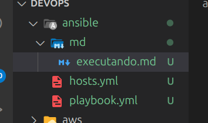
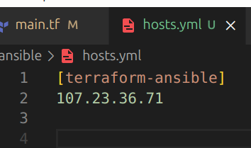
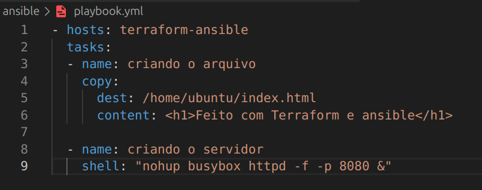
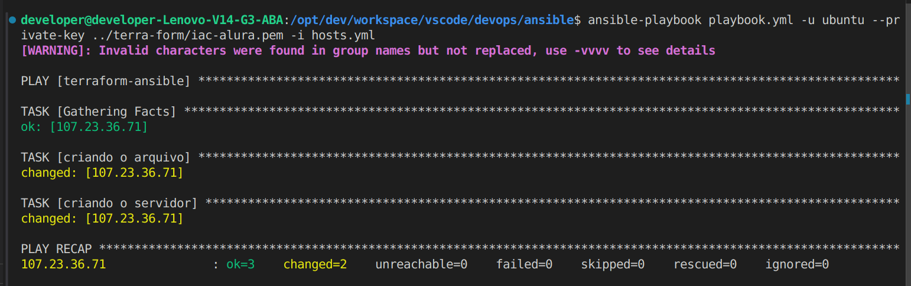

Criar arquivos hosts.yml e playbook.yml:

Configurar Host e Tarefas:

Host:

Tarefas:

Executando:

ansible-playbook playbook.yml -u ubuntu --private-key ../terra-form/iac-alura.pem -i hosts.yml

playbook.yml    -> arquivo de tarefas
-u              -> usuario da instancia na AWS
--private-key   -> chave .pem
-i              -> arquivo de hosts

