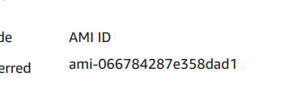
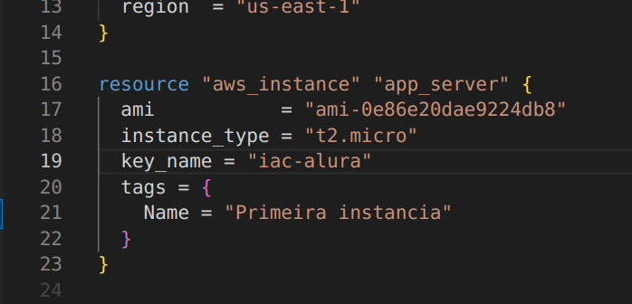
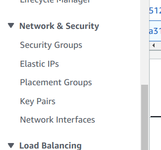
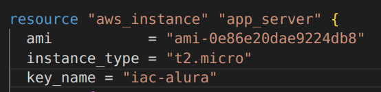
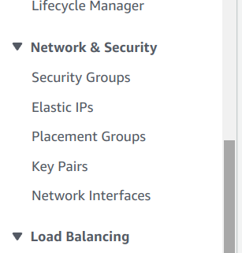
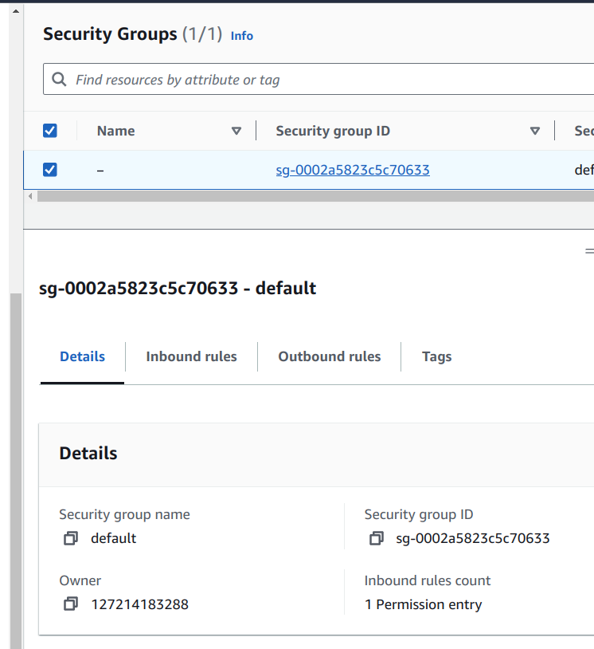
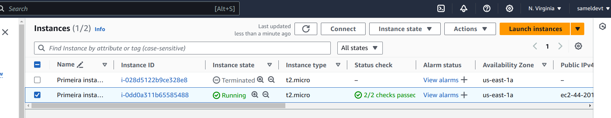
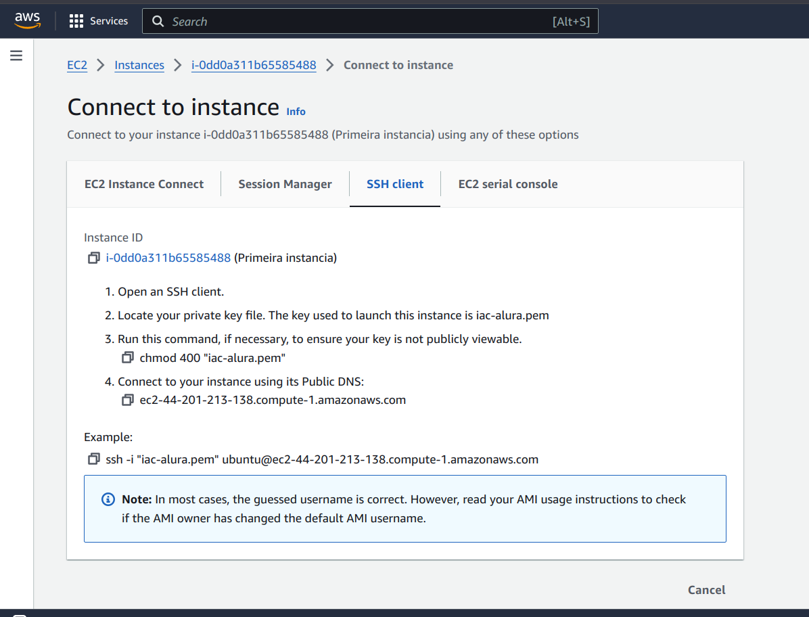

Usando o terraform, copiar AMI ID na tela de criação de instancia:

No arquivo main.tf, adicionar o ami na tag resource:

Gerar par de chaves. Na barra lateral esquerda, buscar por Key Pairs:

Criar novo par de chave, baixar, adicionar nome da chave a tag resource:

Na barra lateral esquerda, clicar em Security Groups:

Nessa janela, escolher o grupo de segurança e adicionar regras de entrada e saída(Inbound rules, Outbound rules):

Regras de entrada:

Nova regra 1 -> Anywhere IPV4
Nova regra 2 -> Anywhere IPV6

Regras de saída:

Nova regra 1 -> Anywhere IPV4
Nova regra 2 -> Anywhere IPV6

Na aba instance, clicar em connect:

Seguir o tutorial:

