Linux

minikube start --vm-driver=virtualbox

criando um pod modo imperativo:
    
$ kubeclt run {nome-do-pod} {imagem-base-do-container}:

$ kubectl run nginx-pod --image=nginx:latest

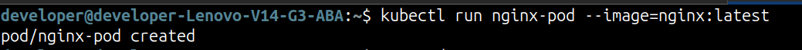

ver lista de pods:

$ kubectl get pods:

ver lista de pods com mais informações:

$ kubectl get pods -o wide

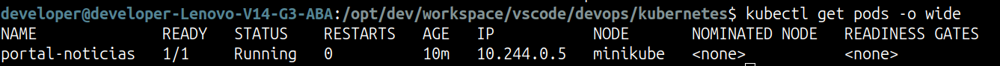

ver lista e assistir mudanças:

$ kubectl get pods --watch;

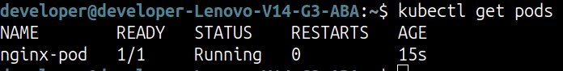

ver informações sobre um pod:

$ kubectl describe pod {nome-do-pod}

$ kubectl describe pod nginx-pod

apagar pods e services:

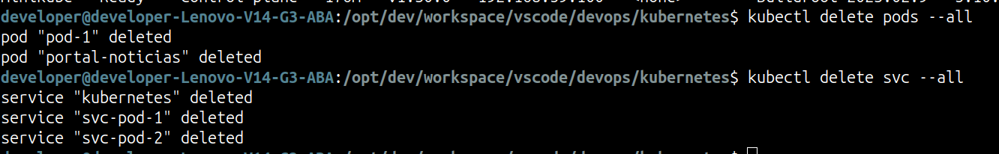

editar um pod:

$ kubectl edit pod {nome-do-pod}

$ kubectl edit pod nginx-pod

criando um pod modo declarativo:

criar um arquivo .yaml:

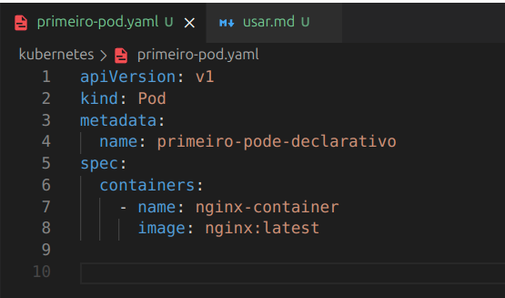

apiVersion   => versão da api do kubernetes;
kind         => o que vamos criar;
metadata     => informações sobre o pod;
  name       => nome do pod;
spec         => especificações do pod;
  containers => lista de containers do pod; 
    - name   => nome do container
      image  => imagem em que o container ira se basear

$ kubectl apply -f {nome-do-arquivo-yaml}

$ kubectl apply -f primeiro-pod.yaml

deletar um pod

$ kubectl delete pod {nome-do-pod}

$ kubectl delete pod nginx-pod

deletar um pod declarativo:

$ kubectl delete -f {arquivo-de-configuracao}

$ kubectl delete -f primeiro-pod.yaml

acessando um pod:

$ kubectl exec -it {nome-do-pod} -- bash => abre no modo interativo usando o bash

$ kubectl exec -it portal-noticias -- bash

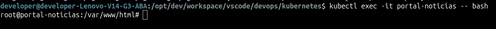

usando serviços:

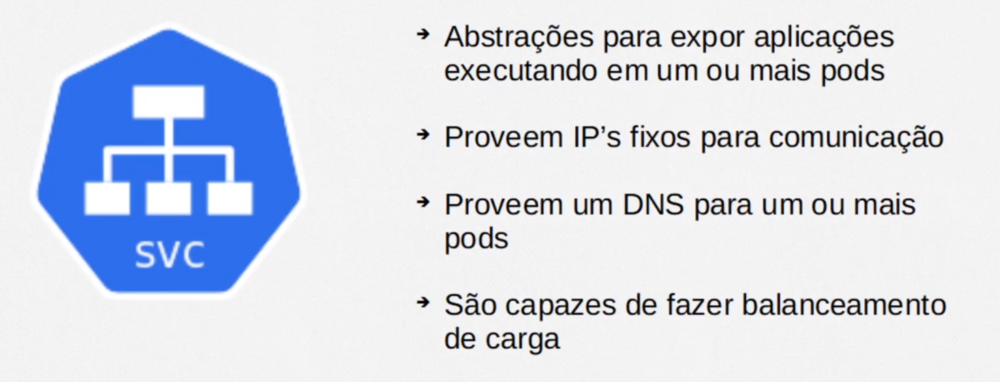

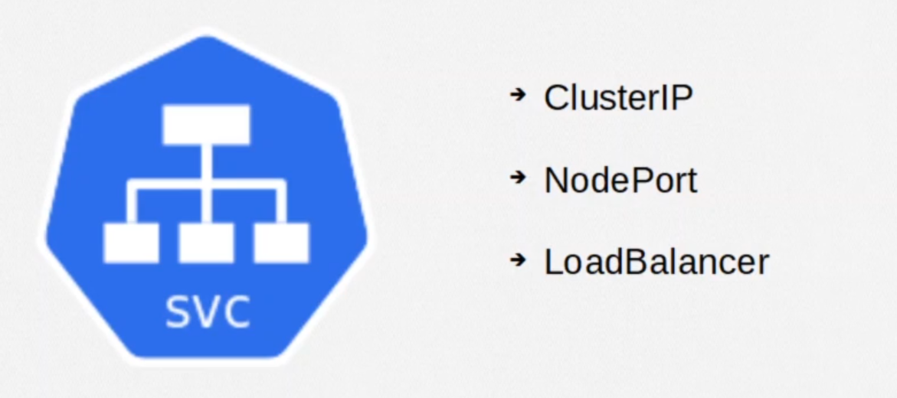

ClusterIP => serve para fazer a comunicação interna entre diferentes pods em um mesmo cluster.

criando um serviço do tipo ClusterIP

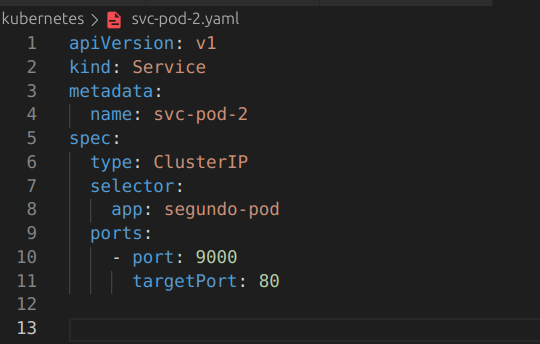

selector => para qual pod esse serviço ira servir
  app    => nome do pod

ports    => com quais portas o serviço irá trabalhar
  port   => porta de recebimento do serviço
  tartgetPort => porta de despache (a porta do pod na qual o serviço esta servindo)

  * como alternativa, pode-se usar no parametro - port: o mesmo valor. por exemplo - port: 80 => essa declaração irá usar a porta 80 tanto para entra quanto para saída dos redirecionamentos

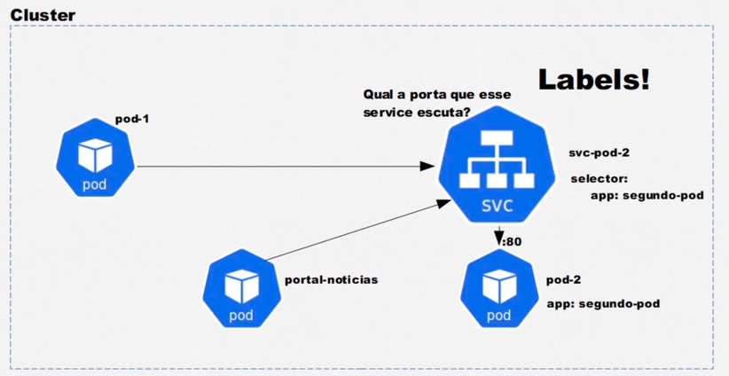

NodePort => permite a comunicação para o mundo externo:

* funciona também como um clusterip

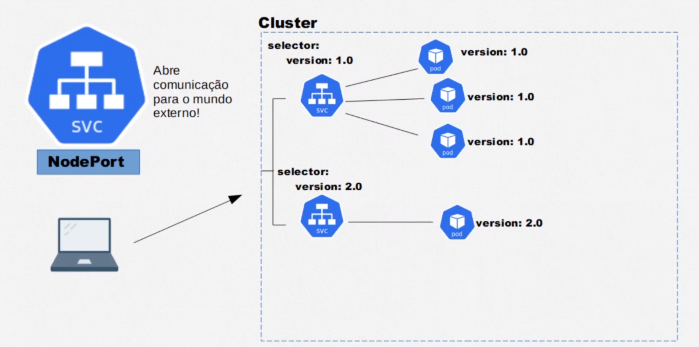

como criar:

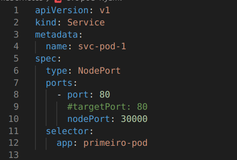

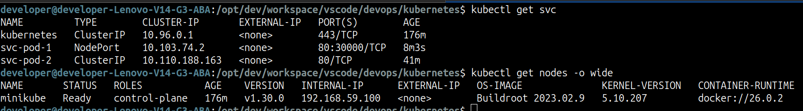

utilizamos o ip do node para acessar o serviço fora do cluster

LoadBalancer => 

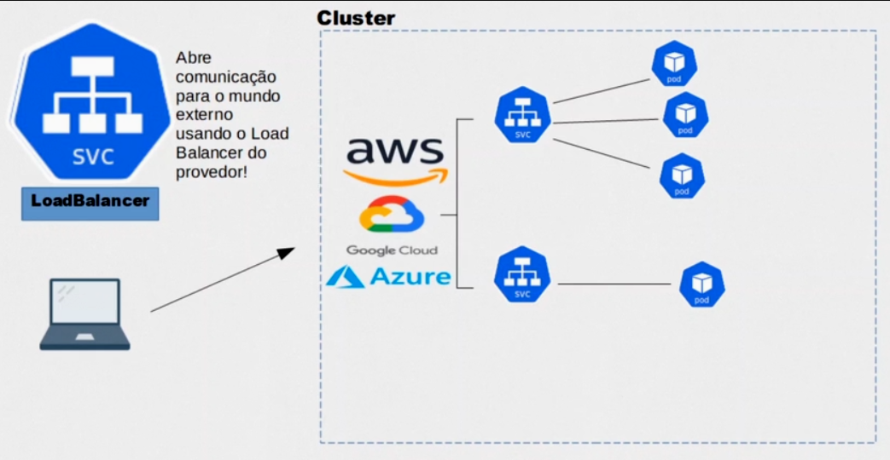

como criar:

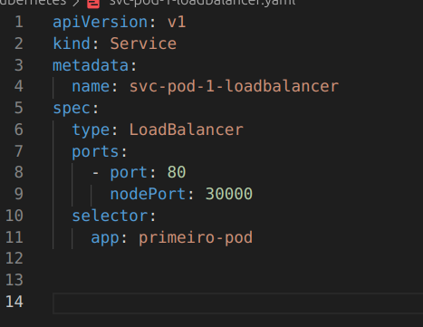